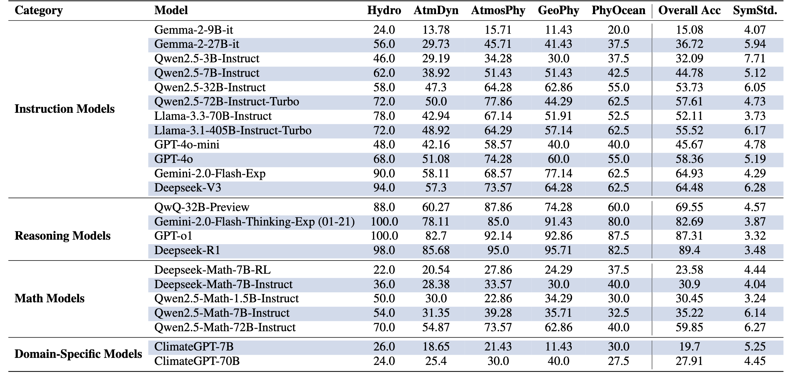

# ATMOSSCI-BENCH
Click here to view Chinese version of README: [中文版](README_cn.md)

Click here to view the Paper: [AstomsSciBench_Arxiv](docs/2025_AtmosSci-Bench_Arxiv.pdf)

## 1. Introduction
### ATMOSSCI-BENCH: Filling the Evaluation Gap
We Introduce ATMOSSCI-BENCH, a comprehensive MCQ(Multi-choices Question) benchmark framework of Atmospheric Science designed for systematically assess LLMs(Large Language Models) performance across five core categories of problems in this discipline:
+ Hydrology examines the distribution, movement, and properties of water on Earth, including the water cycle, precipitation, rivers, lakes, and groundwater dynamics.
+ Atmospheric dynamics focuses on the motion of the atmosphere, including large-scale weather systems, wind patterns, and governing forces of atmospheric circulation.
+ Atmospheric physics covers physical processes such as radiation, thermodynamics, cloud formation, and energy transfer within the atmosphere.
+ Geophysics encompasses the physical processes of the Earth, including its magnetic and gravitational fields, seismic activity, and internal structure.
+ Physical oceanography investigates the physical properties and dynamics of ocean water, including currents, waves, tides, and ocean-atmosphere interactions

Our analysis provides some interesting insights into the reasoning and problem-solving capabilities of LLMs in atmospheric science. We believe ATMOSSCI-BENCH can serve as a critical step toward advancing LLM applications in climate service by offering a standard and rigorous evaluation framework.


|  |
|:--:|
| *Firgure 1: Construction pipeline of our template-based question generation framework. Blocks on the middle left represent the question generation process, where variables are highlighted in different colors. Blocks on the middle right depict the automatic problem solver, which derives the answer from given variables. Bottom blocks illustrate an example of a generated question and its corresponding options. *|


## 2. Analysis Result & Insight

The analysis result indicate that ATMOSSCI-BENCH effectively differentiates LLM performance across categories, with reasoning models demonstrating the highest proficiency. The results confirm that our benchmark successfully distinguishes LLM performance, particularly in assessing reasoning proficiency.

We conduct a comprehensive evaluation of representative LLMs, categorized into four groups: instruction-tuned models, advanced reasoning models, math-augmented models, and domain-specific climate models. Here is the end-to-end evaluation results:

|  |
|:--:|
| *Table 1:  Comparison across four LLMs categories in terms of accuracy (%) and symbolic standard deviation for Hydrology (Hydro), Atmospheric Dynamics (AtmDyn), Atmospheric Physics (AtmosPhy), Geophysics (GeoPhy), and Physical Oceanography (PhyOcean). *|


- [] More Analysis PUT here


## 3. How to Use
### Prerequisites
+ Python 3.10.9
+ Dependencies listed in `requirements.txt`

### Installation
1. Clone this repository.
2. Run `setup.sh`.
3. Manually install any missing dependencies from `requirements.txt`, if necessary.


### Dataset Generation
You can skip this section if you do not need to customize the dataset. The pre-generated dataset is available in Question/generated_datasets.

#### Generate Datasets
1. Add new Question Templates in `Question/Questions`.
2. Add all the Question Templates that you want to output in `Question/question_collection.py`.
3. Set `BATCH_SIZE` which output how many question instances for each Question Templates in `Question/question_collection.py`.
4. Set `PRECISION` at the top of `Question/Questions/question.py`
5. Run `Question/save_to_csv.py` to generate the datasets.
6. All the datasets are saved in `Question/generated_datasets`

#### Visualize Questions
1. Run `streamlit run Question/visualize_all.py`


### Start Evaluation Experiment
You can follow the example below to start your evaluation.

To test with a customized number of test cases in a single run, modify the parameters `--instance_start 1 --instance_end 10`, where `10` represents the total number of test cases. (Note: A dataset ending with `_i50` indicates that only 50 test cases are included.)

To test with an alternative precision level, set the `--dataset` parameter to one of the following:
+ `question_collection_low_precision_i50.csv`
+ `question_collection_high_precision_i50.csv`

Please `cd` to the `Script` folder and run following command:

#### Local Models
##### Hugging face model:

This is an example of running `Qwen/Qwen2.5-32B-Instruct`:
```
huggingface-cli login
python3 ../Question/evaluation.py --model hugging_face --specific_model "Qwen/Qwen2.5-32B-Instruct"  --dataset question_collection_i50.csv --batch_size 8 --instance_start 1 --instance_end 10 --gpu="0,1,2,3,4,5,6,7" --max_new_token 8192
```

##### QwQ

```
python3 ../Question/evaluation.py --model qwq --dataset question_collection_i50.csv --batch_size 8 --instance_start 1 --instance_end 10 --max_new_token 30000 --gpu="0,1,2,3,4,5,6,7"
```


#### Calling APIs
In API calls, the `batch_size` parameter specifies the number of processes invoking the API endpoint concurrently.

Please create `.env` and put your API_KEY:
```
DeepSeek_API_KEY = ""
OPENAI_API_KEY = ""
TOGETHER_API_KEY = ""
FIREWORKS_API_KEY=""
GEMINI_API_KEY=""
```


##### Deepseek_R1 model:
```
python3 ../Question/evaluation.py --model deepseek_reasoner --dataset question_collection_i50.csv --batch_size 8 --instance_start 1 --instance_end 10 --max_new_token 30000
```


##### Deepseek_V3 model:
```
python3 ../Question/evaluation.py --model deepseek_v3 --dataset question_collection_i50.csv --batch_size 8 --instance_start 1 --instance_end 10 --max_new_token 30000
```


##### Fireworks:
```
python3 ../Question/evaluation.py --model fireworks --specific_model "accounts/fireworks/models/deepseek-r1" --dataset question_collection_i50.csv --batch_size 8 --instance_start 1 --instance_end 10 --max_new_token 30000
```

##### gemini-2.0-flash-thinking-exp-01-21:
```
python3 ../Question/evaluation.py --model gemini --dataset question_collection_i50 --dataset question_collection_i50.csv --batch_size 8 --instance_start 1 --instance_end 10 --max_new_token 30000
```


##### gpt-4o and gpt-4o-mini:
```
python3 ../Question/evaluation.py --model gpt-4o --specific_model "gpt-4o" --dataset question_collection_i50.csv --batch_size 8 --instance_start 1 --instance_end 10 --max_new_token 30000
```
```
python3 ../Question/evaluation.py --model gpt-4o --specific_model "gpt-4o-mini" --dataset question_collection_i50.csv --batch_size 8 --instance_start 1 --instance_end 10 --max_new_token 30000
```

##### gpt-o1:
```
python3 ../Question/evaluation.py --model o1 --dataset question_collection_i50.csv --batch_size 8 --instance_start 1 --instance_end 10 --max_new_token 30000
```

##### together:
```
python3 ../Question/evaluation.py --model together --specific_model "Qwen/QwQ-32B-Preview" --dataset question_collection_i50.csv --batch_size 8 --instance_start 1 --instance_end 10 --max_new_token 30000
```

##### together with ray:
```
python3 ../Question/evaluation.py --model together_ray --specific_model "Qwen/QwQ-32B-Preview" --dataset question_collection_i50.csv --batch_size 8 --instance_start 1 --instance_end 10 --max_new_token 30000
```


4. License


5. Contact
If you have any question, please contact ___.